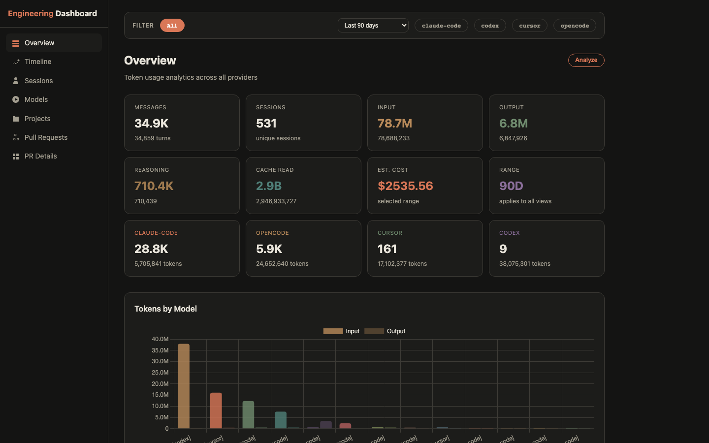
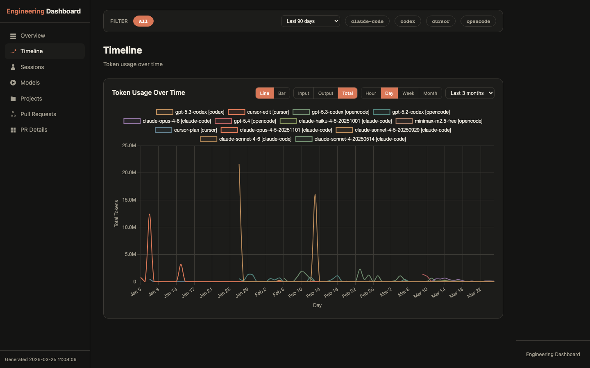
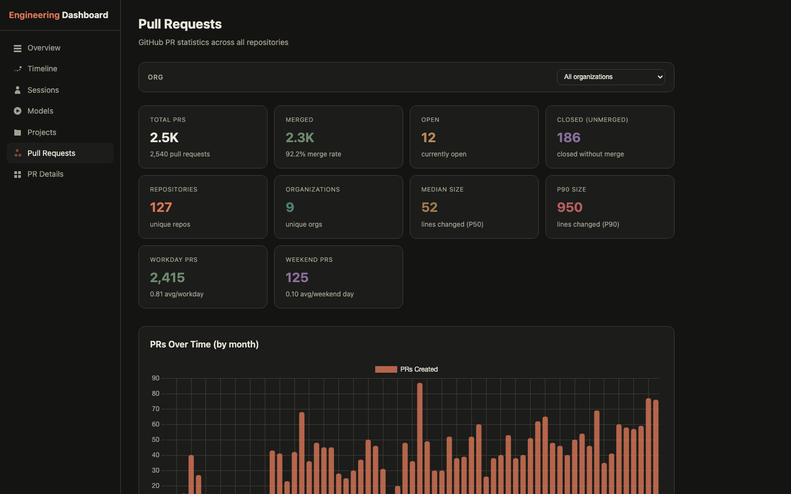
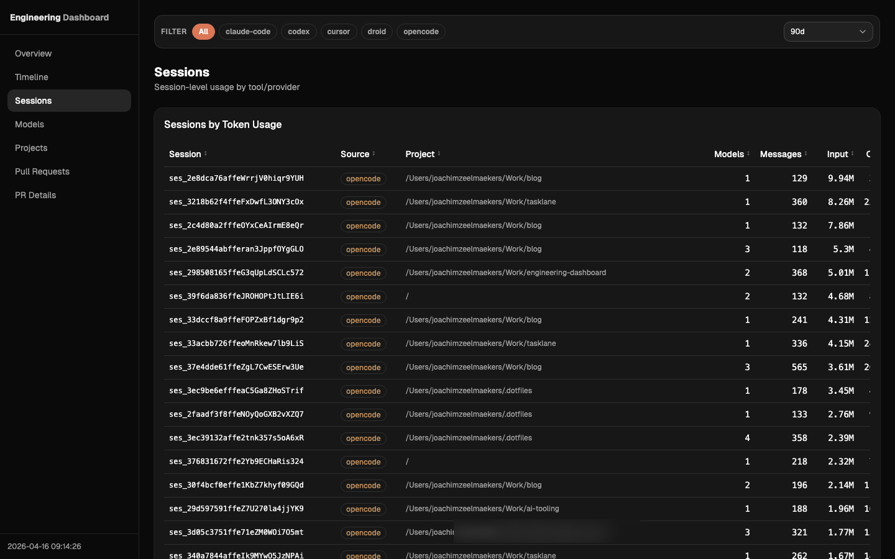

# Engineering Dashboard

Generate a local HTML dashboard with AI tooling usage and GitHub contribution metrics.









## What it collects

- Provider usage (messages, sessions, token usage, estimated cost)
- Timeline and model breakdowns
- Session-level drilldowns
- GitHub PR/review stats (optional, via `gh`)

Supported providers in this repo:

- `claude-code`
- `opencode`
- `cursor`
- `codex`
- `continue`
- `gemini`
- `trae`
- `windsurf`

## Quick start

1. Copy config:

```bash
cp config.example.json config.json
```

2. Enable the providers you want in `config.json`.

3. Generate report:

```bash
make report
```

4. Open:

```bash
make open
```

Or run a local server with auto-regeneration:

```bash
make serve
```

For local frontend development:

```bash
make dev
```

## Project structure

- `src/engineering_dashboard/`: Python source (CLI, aggregation, and providers)
- `src/engineering_dashboard/providers/`: provider readers used by `main.py` to collect local usage data
- `dashboard/`: Astro + React frontend that renders the generated `data.json`
- `output/`: generated HTML reports and canonical JSON output
- `data/`: local cache and historical snapshots

You can run scripts directly with `python3 main.py` and `python3 serve.py`; the Makefile wraps these commands for convenience.

The frontend is static. It reads `output/data.json` (copied into `dashboard/public/data.json` during report generation for local UI development).

## Notes

- This tool reads local app data from common storage paths.
- Some providers expose detailed token counts; others only expose partial metadata.
- If a provider has no local install/data, it is reported as `not found`.

## Attribution

The extraction coverage improvements for multi-tool/local-storage parsing were inspired by and adapted from:

- https://github.com/0xSero/ai-data-extraction

Big thanks to @0xSero for publishing those extraction patterns.

Cost reference data for model pricing is sourced from:

- https://github.com/simonw/llm-prices
- https://www.llm-prices.com/current-v1.json
