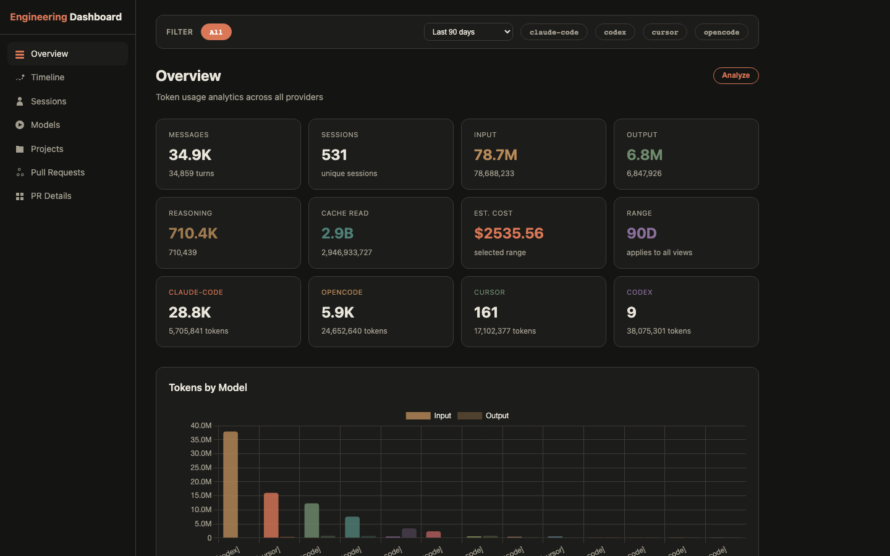
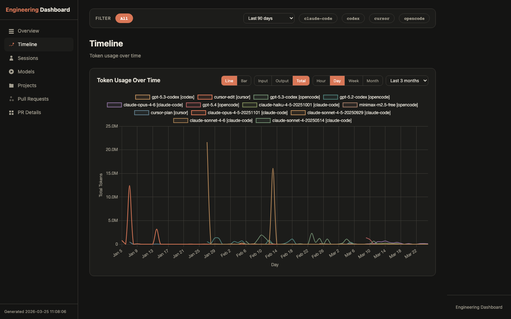
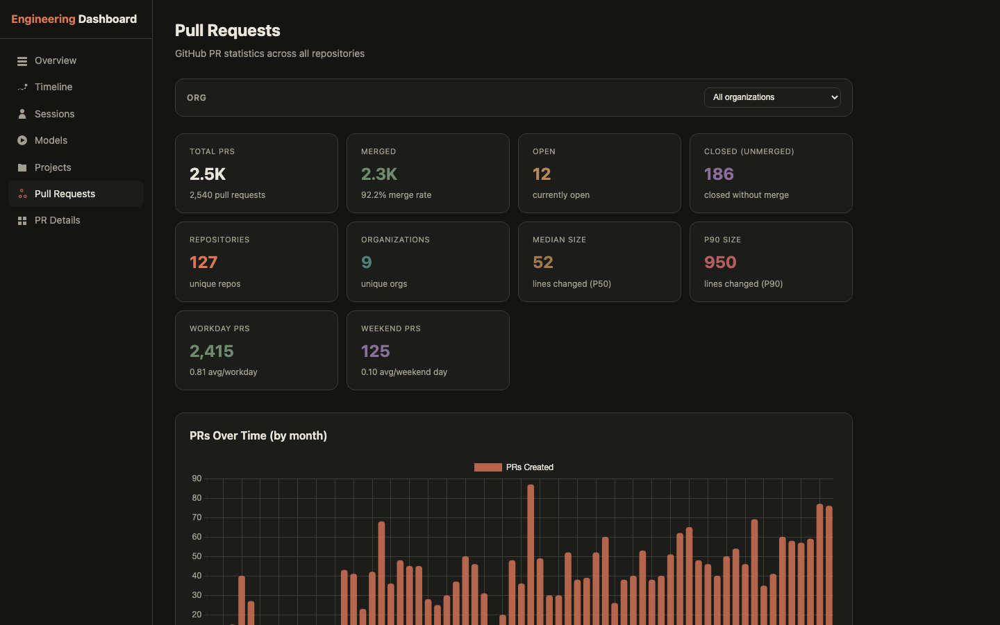
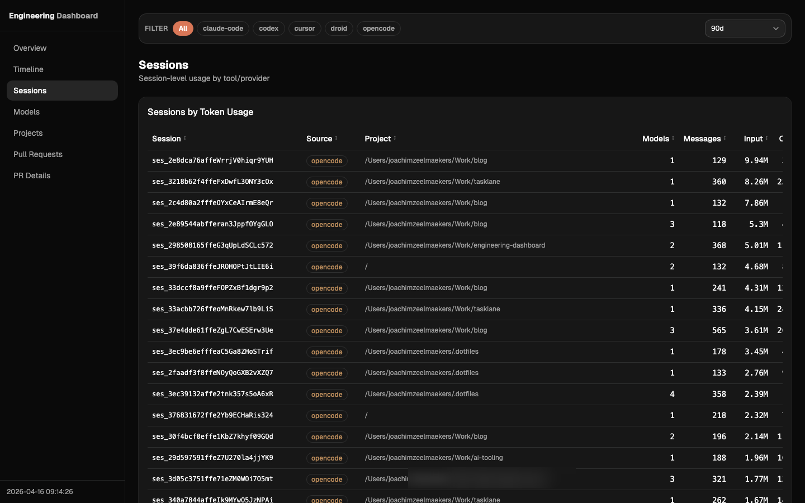
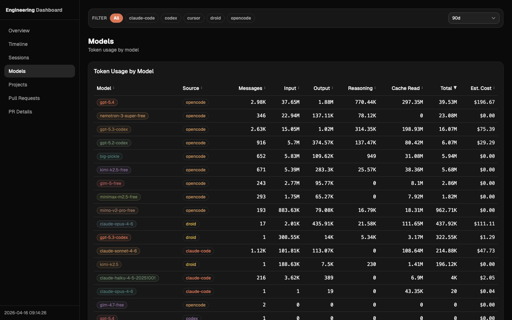
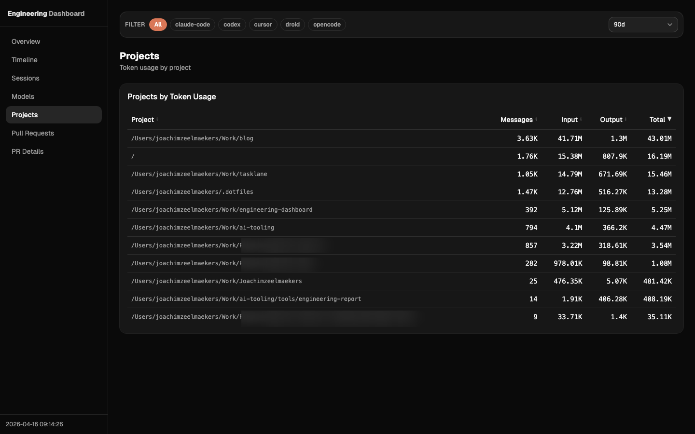

# Engineering Dashboard

Note: this project is fully vibed and code is not being read.

Generate a local shadcn/Astro dashboard with AI tooling usage and GitHub contribution metrics.













## What it collects

- Provider usage (messages, sessions, token usage, estimated cost)
- Timeline and model breakdowns
- Session-level drilldowns
- GitHub PR/review stats (optional, via `gh`) with selectable date ranges

Supported providers in this repo:

- `claude-code`
- `opencode`
- `cursor`
- `codex`
- `continue`
- `gemini`
- `trae`
- `windsurf`
- `droid`
- `omp` (Oh My Pi)
- `pi` (Pi coding agent)

For OMP and Pi, session history is read from `~/.omp/agent/sessions` and `~/.pi/agent/sessions`. Use `OMP_CODING_AGENT_DIR` / `PI_CODING_AGENT_DIR` to override the agent data directory, or `OMP_CODING_AGENT_SESSION_DIR` / `PI_CODING_AGENT_SESSION_DIR` to point directly to the sessions directory.

The Models page shows active input/output/cache-read/cache-write catalog rates per million tokens (USD). Rates use the same explicit and dynamic catalogs as estimated costs; dynamic catalog data is cached for 24 hours and re-fetched during report generation when expired. Unknown model prices appear as `—`.

## Quick start

1. Copy config:

```bash
cp config.example.json config.json
```

2. Enable the providers you want in `config.json`.

3. Generate dashboard data:

```bash
make report
```

4. Start the dashboard (dev mode):

```bash
make dev
```

Then open:

```bash
http://localhost:4321
```

For a production-like preview (build + preview server):

```bash
make serve
```

## Project structure

- `src/engineering_dashboard/`: Python source (CLI, aggregation, and providers)
- `src/engineering_dashboard/providers/`: provider readers used by `main.py` to collect local usage data
- `dashboard/`: Astro + React frontend (shadcn UI)
- `output/`: canonical generated `data.json`
- `data/`: local cache and historical snapshots

You can run scripts directly with `python3 main.py` and `python3 serve.py`; the Makefile wraps these commands for convenience.

The frontend reads `/data.json`. Report generation writes data to `output/data.json` and mirrors it to `dashboard/public/data.json` for dev/build workflows.

## GitHub counting and coverage

- Each report paginates all accessible authored PRs and refreshes their state, merge dates, and changed-line/file counts, including old PRs.
- Reviews count submitted review events, not unique reviewed PRs. Repeat submissions count separately; pending drafts and standalone issue/PR comments do not count. Approved, commented, changes-requested, and dismissed submissions are included.
- Review collection refreshes the configured PR-creation history every run, including new reviews on old PRs. `github.history_start_year` defaults to 2015 and applies to the reviewed PR's creation year, not the review's submission year.
- Both PR-search pages and each PR's review pages are paginated. Review search windows exceeding GitHub's 1,000-result search ceiling are split down to second precision; an indivisible oversized window is reported as incomplete rather than silently accepted.
- Dashboard date filters use PR creation timestamps and review submission timestamps in UTC. Custom start/end dates are inclusive. Organization filtering applies to both; totals and monthly charts include every matching record.
- Previously cached history is retained when repositories are no longer accessible. Those records cannot be refreshed, and unseen activity there cannot be counted. Legacy inaccessible reviews may still use draft-creation dates instead of submission dates. Report-generation warnings identify incomplete refreshes; API failures do not overwrite caches with partial results. Restoring repository access is required for fully current totals.
- Full-history refreshes make more GitHub API requests than the former incremental cache.

## Notes

- This tool reads local app data from common storage paths.
- Some providers expose detailed token counts; others only expose partial metadata.
- If a provider has no local install/data, it is reported as `not found`.

## Attribution

The extraction coverage improvements for multi-tool/local-storage parsing were inspired by and adapted from:

- https://github.com/0xSero/ai-data-extraction

Big thanks to @0xSero for publishing those extraction patterns.

Cost reference data for model pricing is sourced from:

- https://github.com/simonw/llm-prices
- https://www.llm-prices.com/current-v1.json
